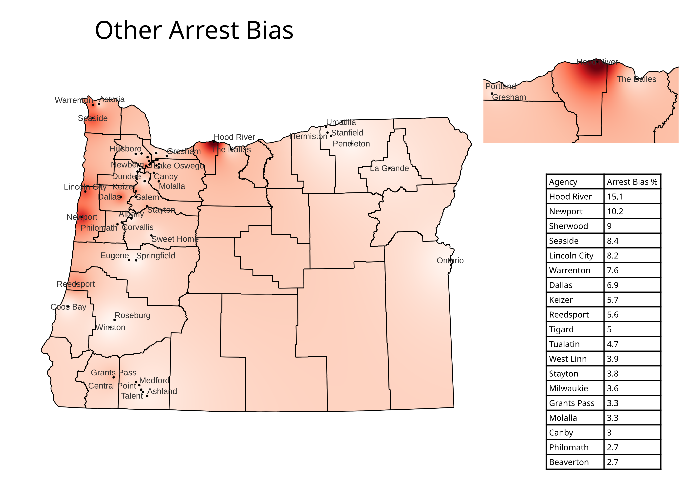
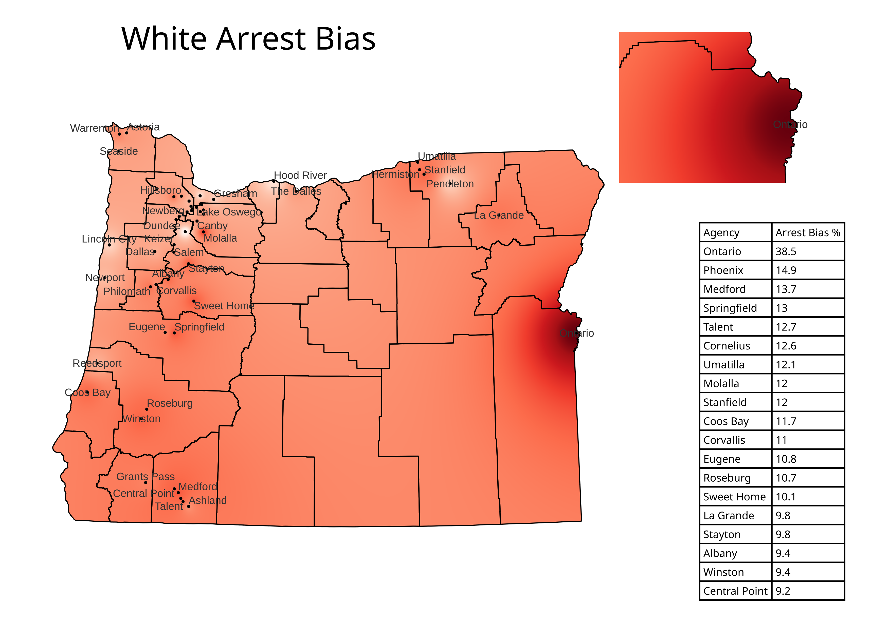

---
output:
  html_document: default
  pdf_document: default
---

<!-- # : Oregon_Arrest_Race.rmd -->

<!-- # Author: @russl_corey -->

<!-- # Date: Dec 14, 2022 -->

<!-- # This program is free software: you can redistribute it and/or modify it under  -->

<!-- # the terms of the GNU General Public License as published by the Free Software  -->

<!-- # Foundation, either version 3 of the License, or (at your option) any later  -->

<!-- # version. -->

<!-- #  -->

<!-- # This program is distributed in the hope that it will be useful, but WITHOUT ANY  -->

<!-- # WARRANTY; without even the implied warranty of MERCHANTABILITY or FITNESS FOR A  -->

<!-- # PARTICULAR PURPOSE. See the GNU General Public License for more details. -->

<!-- # You should have received a copy of the GNU General Public License along with  -->

<!-- # this program. If not, see <https://www.gnu.org/licenses/>.  -->

---
title: "Oregon Arrest and Race Analysis"
author: Russell_Corey
date: December 14, 2022
output: html_document
---

\newpage

```{r setup, echo=FALSE, message=FALSE, warning=FALSE}
library(knitr)
```

```{r load crime data, echo=FALSE, message=FALSE, warning=FALSE}

 setwd('/home/russell/Dropbox/DataAnalysis/Oregon_Arrest_Racial_Bias')

source("Arrests_and_Census.r")

```

# Intro
 This project investigates racial disparities in police arrests in Oregon utilizing
 open source data. The source code and data for this project is hosted at  [Github](https://github.com/russl-corey/Oregon-Arrest-and-Race-Analysis)

# Data

The two data sources used are the "Uniform Crime Reporting" Offenses data and the Oregon 2020 Census data from Portland University.

#### Crime Data

The crime reporting data set is accessible directly from

<https://www.oregon.gov/osp/Pages/Uniform-Crime-Reporting-Data.aspx>

#### Population Data

The Oregon census data can be found at the website

<https://www.pdx.edu/population-research/census-data-oregon>

\newpage

# Methodology

First arrest data is loaded with OpenData-Arrests.r which reads in the corresponding data source
 data/OpenData-Arrests.r. The arrests are then grouped by police agency and race. 
 
Next, census data is loaded using City_data_2020.r which reads data/City_data_2020.xlsx. There are several 
categories of racial demographics. I picked the set that is mutually exclusive, so the total amounts
of each race will add up to 100% of the total population. 

Then using Arrests_and_Census.r and the table data/agencies_cities_map_cities_only.csv the names of police departments are 
joined to the city names in City_data_2020. Only cities with corresponding police departments are kept. 


Then using the race demographics in the census data, the percentage of each race population is 
calculated for each city. Then the percentage of each police department's arrests are 
for each race. Then the percentage of arrests for each race is subtracted by the corresponding
race population percentage for each police department/city.

# Results

```{r race bias table, echo=FALSE, message=FALSE, warninig=FALSE}


agency_pop %>% select(city,  black_diff, latino_diff, native_diff, 
                      pacific_diff, asian_diff, other_diff) %>%
  arrange(desc(black_diff)) %>%
  head() %>%
  kable()

```
```{r race bias pie chart, echo=FALSE, message=FALSE, warninig=FALSE}

portland <- agency_pop[agency_pop$city_trim == 'Portland',]

data_pop <- portland %>% select( 'native', 'asian', 'black','latino', 'pacific', 'other', 'white')

data_arrest <- portland %>% select( 'native_arrests', 'asian_arrests', 'black_arrests', 'latino_arrests','pacific_arrests', 'other_arrests', 'white_arrests')

pie(t(data_pop), labels=c( ' ', 'asian', 'black', 'latino',' ', ' ', 'white'), 
    main="Portland Population")

pie(t(data_arrest), labels=c( '','asian arrests','black arrests', 'latino arrests','', '', 'white arrests'), 
    main="Portland Arrests")

```
# Result Visualiazion

Map plots of each racial bias 


# Correlation Analysis

We want to inspect potential correlations between racial population density and arrest biases. First we 
will inspect the data to see what type of correlations we may want to perform.

```{r Bar plot distributions, echo=FALSE, message=FALSE}


for(data_label in c('black_arrests_percnt', 'black_percnt')){
  
  x <- agency_pop[[data_label]]
  
  # Two rows, two columns
  par(mfrow = c(1, 3))
  
  # Plots
  hist(x, main = paste(data_label, "Distribution"))   # Top left
  qqnorm(x, main = 'QQ Plot') #create Q-Q plot
  qqline(x) #add straight diagonal line to plot
  boxplot(x, main = "Box Plot")               # Top right
  
  # Back to the original graphics device
  par(mfrow = c(1, 1))
    
}

```

From the QQ plots we see most of the data series are not normally distributed. See Appendix A3 for all the plots. So we will perform a Spearman's correlation since the data does not meet the assumptions of the Pearson's correlation test. 


# Spearman Correlation matrix
```{r Spearman Correlation plot, results='asis', echo=FALSE, warning=FALSE, message=FALSE}
library("ggcorrplot")      

agency_pop %>%
  select(c('native_diff', 'asian_diff', 'black_diff', 'latino_diff', 
            'pacific_diff', 'white_diff','native_percnt', 
           'black_percnt', 'asian_percnt', 'latino_percnt',
           'white_percnt')) %>%
  cor(method = 'spearman') %>%
 ggcorrplot(show.diag = FALSE, type = 'lower', lab=TRUE) +  
  ggplot2::theme(axis.text.y=ggplot2::element_text(size=10),
                 axis.text.x=ggplot2::element_text(size=8),
                 legend.text=ggplot2::element_text(size=10))
agency_pop %>%
  select(c('native_diff', 'asian_diff', 'black_diff', 'latino_diff', 
            'pacific_diff', 'white_diff')) %>%
  cor(method = 'spearman') %>%
 ggcorrplot(show.diag = FALSE, type = 'lower', lab=TRUE) +  
  ggplot2::theme(legend.text=ggplot2::element_text(size=10))

agency_pop %>%
  select(c('native_percnt', 'black_percnt', 'asian_percnt', 'latino_percnt', 'other_percnt', 'white_percnt')) %>%
  cor(method = 'spearman') %>%
 ggcorrplot(show.diag = FALSE, type = 'lower', lab=TRUE) +  
  ggplot2::theme(legend.text=ggplot2::element_text(size=10))

```

For comparison, the Pearson's correlation.
```{r Pearson correlation, echo=FALSE, warning=FALSE}
agency_pop %>%
  select(c('native_diff', 'asian_diff', 'black_diff', 'latino_diff', 
            'pacific_diff', 'white_diff','native_percnt', 
           'black_percnt', 'asian_percnt', 'latino_percnt',
           'white_percnt')) %>%
  cor() %>%
 ggcorrplot(show.diag = FALSE, type = 'lower', lab=TRUE) +  
  ggplot2::theme(axis.text.y=ggplot2::element_text(size=10),
                 axis.text.x=ggplot2::element_text(size=8),
                 legend.text=ggplot2::element_text(size=10))
```
Closer inspection of data fields with statistically significant correlation values.
```{r Linear plots of Correlations, echo=FALSE}
agency_pop %>%
  ggplot( aes(white_percnt, latino_percnt)) +
  labs(title = "Line Plot Population Density") +
  geom_point() +
  geom_smooth(method='lm')

agency_pop %>%
  ggplot( aes(white_diff, latino_diff)) +
  labs(title = "Line Plot Arrest Density") +
  geom_point() +
  geom_smooth(method='lm')

agency_pop %>%
  ggplot( aes(black_percnt, black_diff)) +
  labs(title = "Line Arrest vs Population Density") +
  geom_point() +
  geom_smooth(method='lm')

agency_pop %>%
  ggplot( aes(asian_percnt, asian_diff)) +
  labs(title = "Line Arrest vs Population Density") +
  geom_point() +
  geom_smooth(method='lm')
```


# Sources

#### Oregon Crime Data

"Oregon State Police: Uniform Crime Reporting"

    https://www.oregon.gov/osp/Pages/Uniform-Crime-Reporting-Data.aspx

#### Oregon Census Data

"Census Data for Oregon" Population Research Center

    https://www.pdx.edu/population-research/census-data-oregon 

Direct link for data set:

    https://drive.google.com/uc?export=download&id=1JrrmYiQUBPux8nnJ88epAAk9U5rbRDBD


#### Oregon Spatial Data Library

"Oregon Counties - 2015"

    https://spatialdata.oregonexplorer.info/geoportal/details;id=361c06fee9de4e24a72e280fb386a771

# Appendi A1 Result Table
```{r Append A , echo=FALSE, message=FALSE, warninig=FALSE}


agency_pop %>% select(city,black_diff, latino_diff, native_diff, 
                      pacific_diff, asian_diff, other_diff, white_diff) %>%
  kable(round=3)

```
# Appendex A2 Maps






\newpage

# Appendix A3 Arrest Biases Arranged

```{r appendi A3, echo=FALSE, message=FALSE}

agency_pop %>% select(city, asian_diff, asian_arrests_percnt, asian_percnt) %>%
  arrange(desc(asian_diff)) %>%
  kable()

agency_pop %>% select(city,  black_diff, black_arrests_percnt, black_percnt) %>%
  arrange(desc(black_diff)) %>%
  kable()

agency_pop %>% select(city,  latino_diff, latino_arrests_percnt, latino_percnt) %>%
  arrange(desc(latino_diff)) %>%
  kable()

agency_pop %>% select(city,  native_diff, native_arrests_percnt, native_percnt) %>%
  arrange(desc(native_diff)) %>%
  kable()

agency_pop %>% select(city,  other_diff, other_arrests_percnt, other_percnt) %>%
  arrange(desc(other_diff)) %>%
  kable()

agency_pop %>% select(city,  pacific_diff, pacific_arrests_percnt, pacific_percnt) %>%
  arrange(desc(pacific_diff)) %>%
  kable()
```

\newpage

# Appendix A4 Data Distributions
```{r appendix A4, echo=FALSE, message=FALSE}


for(data_label in c('latino_arrests_percnt', 'black_arrests_percnt', 'native_arrests_percnt',
                    'asian_arrests_percnt', 'pacific_arrests_percnt', 'white_arrests_percnt')){
  
  x <- agency_pop[[data_label]]
  
  # Two rows, two columns
  par(mfrow = c(1, 3))
  
  # Plots
  hist(x, main = paste(data_label, "Distribution"))   # Top left
  qqnorm(x, main = 'QQ Plot') #create Q-Q plot
  qqline(x) #add straight diagonal line to plot
  boxplot(x, main = "Box Plot")               # Top right
  
  # Back to the original graphics device
  par(mfrow = c(1, 1))
    
}

for(data_label in c('latino_percnt', 'black_percnt', 'native_percnt',
                    'asian_percnt', 'pacific_percnt', 'white_percnt')){
  
  x <- agency_pop[[data_label]]
  
  # Two rows, two columns
  par(mfrow = c(1, 3))
  
  # Plots
  hist(x, main = paste(data_label, "Distribution"))   # Top left
  qqnorm(x, main = 'QQ Plot') #create Q-Q plot
  qqline(x) #add straight diagonal line to plot
  boxplot(x, main = "Box Plot")               # Top right
  
  # Back to the original graphics device
  par(mfrow = c(1, 1))
    
}

```

# Appendix B

source code available at <https://github.com/russl-corey/Oregon_Crime>

This program is free software: you can redistribute it and/or modify it under the terms of the GNU General Public License as published by the Free Software Foundation, either version 3 of the License, or (at your option) any later version.

This program is distributed in the hope that it will be useful, but WITHOUT ANY WARRANTY; without even the implied warranty of MERCHANTABILITY or FITNESS FOR A PARTICULAR PURPOSE. See the GNU General Public License for more details. You should have received a copy of the GNU General Public License along with this program. If not, see [\<https://www.gnu.org/licenses/\>](https://www.gnu.org/licenses/).
